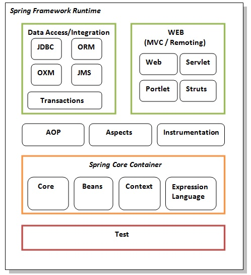

### IoC Container

1. Using BeanFactory
2. Using ApplicationContext

The IoC container is responsible to instantiate, configure and assemble the objects. The IoC container gets informations from the XML file and works accordingly. The main tasks performed by IoC container are:

to instantiate the application class
* to configure the object
* to assemble the dependencies between the objects
There are two types of IoC containers. They are:

**BeanFactory**
ApplicationContext
Difference between BeanFactory and the ApplicationContext
The org.springframework.beans.factory.BeanFactory and the org.springframework.context.ApplicationContext interfaces acts as the IoC container. The ApplicationContext interface is built on top of the BeanFactory interface. It adds some extra functionality than BeanFactory such as simple integration with Spring's AOP, message resource handling (for I18N), event propagation, application layer specific context (e.g. WebApplicationContext) for web application. So it is better to use ApplicationContext than BeanFactory.

#### **Using BeanFactory**

The XmlBeanFactory is the implementation class for the BeanFactory interface. To use the BeanFactory, we need to create the instance of XmlBeanFactory class as given below:

`Resource resource=new ClassPathResource("applicationContext.xml"); `

`BeanFactory factory=new XmlBeanFactory(resource);  `

The constructor of XmlBeanFactory class receives the Resource object so we need to pass the resource object to create the object of BeanFactory.

#### Using ApplicationContext

The ClassPathXmlApplicationContext class is the implementation class of ApplicationContext interface. We need to instantiate the ClassPathXmlApplicationContext class to use the ApplicationContext as given below:

`ApplicationContext context =   
new ClassPathXmlApplicationContext("applicationContext.xml");  `
The constructor of ClassPathXmlApplicationContext class receives string, so we can pass the name of the xml file to create the instance of ApplicationContext.